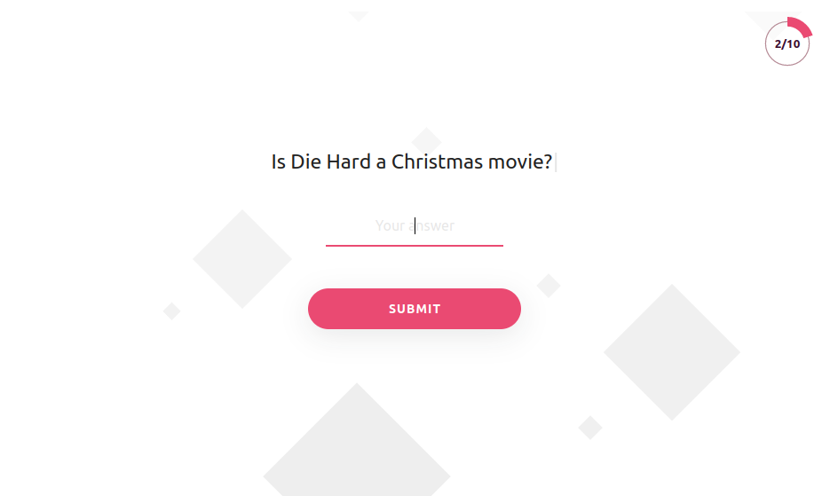

# Mini Scavenger Hunt

Answer a series of questions to get a "prize" link.

### Requirements

* Java 11 or later

### Setup

* Clone this repository
* Define your questions, answers, prize link, etc. in `quiz.yaml`
* Run the app `./gradlew bootRun`
* Check out quiz at http://localhost:8080

### Useful:
* [Build & Run](doc/build-and-run.md)
* [API examples](doc/api-call-examples.md)
* [GitLab setup](doc/gitlab-setup.md) *
* [Kubernetes setup](doc/kubernetes-setup.md) *

* Relevant if you wish to run the app in Kubernetes

### Library docs:

* [Materialize](https://materializecss.com)
* [ProgressBar.js](https://kimmobrunfeldt.github.io/progressbar.js)
* [TypewriterJS](https://safi.me.uk/typewriterjs)
